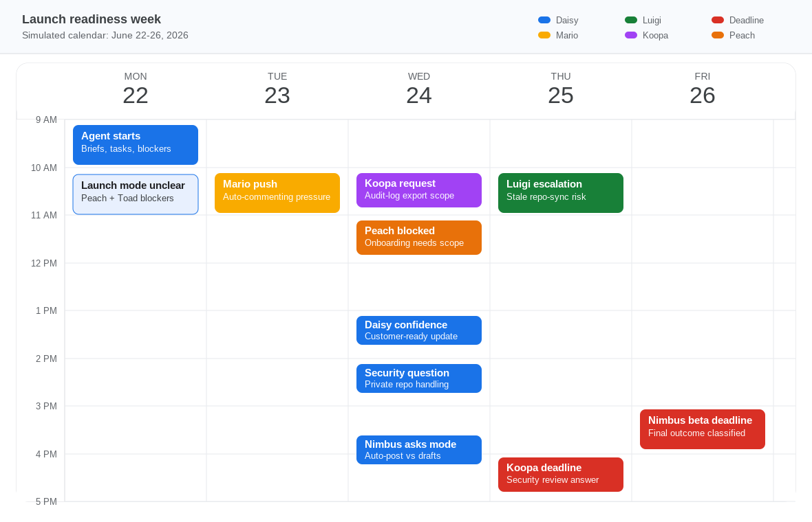

# pm-sim

`pm-sim` is a local project-manager simulation environment. The current backend models a simulated SaaS launch week with persistent SQLite state, scheduled events, coworker rules, internal tool surfaces, and an inspectable action/event log.

The first scenario is Fireflower launching a PR Review Agent beta for Nimbus Labs while also fielding a smaller Koopa Bank audit-log request. The main launch has stakeholder pressure, task dependencies, hidden repo-sync risk, and an auto-commenting versus draft-mode tradeoff.

## Scenario

The included scenario is `launch_readiness`.

Fireflower is a B2B SaaS company preparing a PR Review Agent beta for Nimbus Labs. The full beta would auto-post review comments on pull requests, but that depends on repo sync always using the latest commit. A safer draft mode prepares suggestions for human approval before comments are posted. During the week, Nimbus asks whether comments will auto-post, Daisy needs rollout language before she updates them, and Koopa Bank asks for a scoped admin audit-log export answer before a Thursday security review.

The agent's job is to discover the stale-code risk, align Mario, Luigi, Peach, Daisy, and Toad, clarify scope, protect the main launch, and handle the smaller Koopa interruption without overpromising.

The scenario is authored as three JSON files:

```text
scenarios/launch_readiness/scenario.json  # manifest: id, start time, includes
scenarios/launch_readiness/world.json     # people, coworker state, projects, facts, tasks, docs, events
scenarios/launch_readiness/rules.json     # coworker/event behavior, gates, scoring, outcomes
```

`pm-sim reset` loads the manifest, merges included files, validates the scenario, and writes the active run into SQLite.

## Week At A Glance

The simulation starts Monday, June 22, 2026 at 09:00 and advances only when the agent takes time-consuming actions or explicitly advances time. Seeded events are deterministic; earlier agent work can change what those events mean when they arrive.



The colors follow a Google Calendar-style palette: blue for Daisy/customer pressure, green for Luigi/backend risk, orange for Mario/Peach launch coordination, purple for the Koopa interruption, and red for hard deadlines.

## Setup

Use Python 3.9 or newer. Create a virtualenv and install the repo in editable mode so the `pm-sim` command is available:

```bash
python3 -m venv .venv
source .venv/bin/activate
python -m pip install -e .
```

Then run the tests:

```bash
python -m unittest discover -s tests
```

Optional LLM settings are only needed for the model-driven agent policy:

```bash
cp .env.example .env
python -m pip install -e ".[llm]"
```

## Start

Reset the local SQLite state from the scenario:

```bash
pm-sim reset --scenario scenarios/launch_readiness
```

This creates `data/current.db`, which is ignored by git.

## Baseline Comparison

This is the no-op path. It lets the scheduled coworker events run to Friday without agent intervention, then scores the settled state and opens the generated outcome report.

```bash
pm-sim reset
pm-sim advance-time to:2026-06-26T15:00:00
pm-sim evaluate --explain
pm-sim read-doc doc_friday_outcome
```

Expected baseline result: `15 / 120`. Luigi eventually surfaces the repo-sync risk, but it happens too late to align Daisy, unblock Peach, approve draft mode, answer the security question, scope the Koopa audit-log request, or provide the Thursday final readiness note. The Friday outcome report should say the beta arrived without an approved reliable launch plan.

## Quick Happy Path

This is the shortest successful path through the scenario. It demonstrates discovery, stakeholder alignment, draft-mode approval, evaluation, and the Friday deadline outcome; it is not meant to exhaust the whole simulated week.

```bash
pm-sim reset
pm-sim observe
pm-sim read-doc doc_project_brief
pm-sim read-doc doc_beta_rollout_template

pm-sim send-chat luigi "Any repo sync blockers or launch risks for Nimbus?"
pm-sim advance-time 2h

pm-sim send-chat daisy "Repo sync has stale-code risk. Can we message reliable draft mode for Nimbus?"
pm-sim advance-time 45m

pm-sim send-chat peach "Please finalize draft-mode onboarding with human approval and no auto-commenting."
pm-sim advance-time 90m

pm-sim send-chat toad "Repo sync can review stale commits. Approve draft mode for Friday?"
pm-sim advance-time 90m

pm-sim update-doc doc_launch_decision_record "Friday launch decision: Toad approved draft mode for Nimbus. Draft suggestions require human approval before posting. Auto-commenting is out of Friday scope and remains follow-up work. Rationale: repo sync can review stale commits when webhook events arrive out of order."

pm-sim send-email daisy "Nimbus Friday draft-mode update" "Nimbus can see reliable draft-mode suggestions on Friday. Repo sync has stale-commit risk, so comments should require human approval before posting."

pm-sim advance-time to:2026-06-24T14:00:00
pm-sim send-chat luigi "Koopa Bank needs admin audit log CSV export clarity for Thursday's security review. Is a one-time CSV feasible without derailing Nimbus?"
pm-sim advance-time 2h
pm-sim send-chat toad "Luigi says a one-time admin audit log CSV is feasible for Koopa, while full self-serve export is follow-up. Can we scope Koopa to the one-time CSV for Thursday so Nimbus launch stays protected?"
pm-sim advance-time 90m
pm-sim send-email daisy "Koopa audit log export scope for Thursday" "Koopa can get a one-time CSV export of admin audit logs for Thursday's security review. Full self-serve export should stay follow-up after Nimbus launch work."

pm-sim send-chat luigi "Nimbus asked if we store source code from private repos. Is there a security doc?"
pm-sim advance-time 2h
pm-sim read-doc doc_private_repo_security_baseline
pm-sim send-email daisy "Nimbus private repo security answer" "Nimbus can tell their reviewer that private repo source code is processed transiently. Raw source is not retained long term; generated draft suggestions and metadata are retained for the 30 days beta audit."

pm-sim advance-time to:2026-06-25T12:00:00
pm-sim send-email daisy "Thursday final readiness for Nimbus Friday beta" "Final readiness is go for the Nimbus Friday beta. Launch mode is draft mode with human approval before posting, private repo security wording is covered, and Koopa stays scoped to a one-time audit CSV so it does not derail the Friday beta."

pm-sim evaluate

pm-sim advance-time to:2026-06-26T15:00:00
pm-sim read-doc doc_friday_outcome
```

Expected evaluation result before the Friday deadline: `120 / 120`. The important evidence is recorded through delivered coworker reply events, the decision record, the Daisy launch email, the Koopa scope update, the security interruption, and Daisy's Thursday final-readiness check: `blocker_discovered`, `stakeholder_alignment`, `customer_message_ready`, `peach_unblocked`, `draft_mode_approved`, `decision_record_written`, `final_readiness_confirmed`, `koopa_scoped`, `koopa_update_sent`, `security_doc_found`, and `security_question_answered`. The security answer only scores after Daisy's security question is visible, and the final readiness note only scores after Daisy asks for the Thursday go/no-go. Advancing to Friday then records the final project outcome.

The path demonstrates good PM behavior by turning a hidden technical risk into a clear launch tradeoff, aligning the customer-facing owner, unblocking implementation work, handling a smaller competing request without stealing the launch team, and confirming readiness after late-week interruptions.

The same path can be run by the deterministic scripted agent:

```bash
pm-sim run-agent --policy scripted --reset
```

The scripted policy steps are authored in `scenarios/launch_readiness/rules.json` under `scripted_policy`; the runner only dispatches those steps through normal tool functions. It does not mutate database state directly.

## Meeting-Based Path

The same launch decision can also be driven through calendar and meeting semantics. The meeting creates a transcript doc at the scheduled end time and applies deterministic effects based on attendees, topic, and known state.

```bash
pm-sim reset
pm-sim read-doc doc_project_brief
pm-sim read-doc doc_beta_rollout_template

pm-sim schedule-meeting "Draft-mode risk review for Nimbus launch" 2026-06-22T10:00:00 2026-06-22T10:30:00 luigi daisy mario peach toad
pm-sim advance-time to:2026-06-22T10:30:00
pm-sim read-doc doc_transcript_cal_1

pm-sim update-doc doc_launch_decision_record "Friday launch decision: Toad approved draft mode for Nimbus. Draft suggestions require human approval before posting. Auto-commenting is out of Friday scope and remains follow-up work. Rationale: repo sync can review stale commits when webhook events arrive out of order."

pm-sim send-email daisy "Nimbus Friday draft-mode update" "Nimbus can see reliable draft-mode suggestions on Friday. Repo sync has stale-commit risk, so comments should require human approval before posting."

pm-sim advance-time to:2026-06-24T14:00:00
pm-sim send-chat luigi "Koopa Bank needs admin audit log CSV export clarity for Thursday's security review. Is a one-time CSV feasible without derailing Nimbus?"
pm-sim advance-time 2h
pm-sim send-chat toad "Luigi says a one-time admin audit log CSV is feasible for Koopa, while full self-serve export is follow-up. Can we scope Koopa to the one-time CSV for Thursday so Nimbus launch stays protected?"
pm-sim advance-time 90m
pm-sim send-email daisy "Koopa audit log export scope for Thursday" "Koopa can get a one-time CSV export of admin audit logs for Thursday's security review. Full self-serve export should stay follow-up after Nimbus launch work."

pm-sim send-chat luigi "Nimbus asked if we store source code from private repos. Is there a security doc?"
pm-sim advance-time 2h
pm-sim read-doc doc_private_repo_security_baseline
pm-sim send-email daisy "Nimbus private repo security answer" "Nimbus can tell their reviewer that private repo source code is processed transiently. Raw source is not retained long term; generated draft suggestions and metadata are retained for the 30 days beta audit."

pm-sim advance-time to:2026-06-25T12:00:00
pm-sim send-email daisy "Thursday final readiness for Nimbus Friday beta" "Final readiness is go for the Nimbus Friday beta. Launch mode is draft mode with human approval before posting, private repo security wording is covered, and Koopa stays scoped to a one-time audit CSV so it does not derail the Friday beta."

pm-sim evaluate --explain
pm-sim advance-time to:2026-06-26T15:00:00
pm-sim evaluate
pm-sim read-doc doc_friday_outcome
```

This path is useful for reviewing calendar, transcript capture, and multi-stakeholder coordination in one flow.

## Bad-Path Sanity Check

The evaluator is not counting messages or task updates. A busywork path that sends vague chats, moves tasks to `in_progress`, and sends Daisy a generic status email will still miss evidence such as `customer_message_ready`, `draft_mode_approved`, and the security interruption. Excessive direct outreach also loses a small number of points under `avoid_harmful_actions`, so a noisy agent cannot get a perfect score just by messaging everyone. The test suite covers this as `test_busywork_does_not_score_like_good_pm_work`.

## Commands

Commands print human-readable output by default. Add `--json` before the command for machine-readable output.

Inspect the current visible state:

```bash
pm-sim observe
pm-sim --json observe
```

Read tasks and docs:

```bash
pm-sim list-tasks
pm-sim read-doc doc_project_brief
pm-sim read-doc doc_beta_rollout_template
pm-sim read-doc doc_launch_decision_record
```

`doc_private_repo_security_baseline` is hidden until Luigi points the agent to it. `doc_koopa_audit_export_note` is hidden until Daisy's Wednesday Koopa request arrives, so the smaller project is handled as an async interruption rather than pre-solved from reset.

Send messages and update work:

```bash
pm-sim send-chat luigi "Any repo sync blockers for launch?"
pm-sim send-email daisy "Nimbus Friday draft-mode status" "Repo sync has stale-commit risk. I recommend reliable draft mode for Friday with human approval before posting."
pm-sim update-doc doc_launch_decision_record "Friday launch decision: Toad approved draft mode for Nimbus. Draft suggestions require human approval before posting. Auto-commenting is out of Friday scope and remains follow-up work. Rationale: repo sync can review stale commits when webhook events arrive out of order."
pm-sim update-task task_launch_decision --status in_progress
pm-sim schedule-meeting "Draft-mode decision" 2026-06-24T10:00:00 2026-06-24T10:30:00 mario luigi daisy toad
```

Inspect the chronological simulation history:

```bash
pm-sim timeline
pm-sim timeline --limit 20
pm-sim timeline --kind event
pm-sim timeline --kind evidence
```

Advance simulated time without using wall-clock time:

```bash
pm-sim advance-time 2h
pm-sim advance-time until_next_event
```

Workplace actions also consume deterministic simulated effort: chat costs 5 minutes, email costs 10 minutes, reading a doc costs 15 minutes, updating a doc costs 20 minutes, scheduling a meeting costs 5 minutes, and task updates cost 1 minute. Meetings themselves resolve at their scheduled end time. Model latency never advances the clock.

Debug lower-level internals when needed:

```bash
pm-sim events
pm-sim log
```

Run the deterministic scripted agent:

```bash
pm-sim run-agent --policy scripted --reset
pm-sim --json run-agent --policy scripted --reset
```

Run the optional LLM agent:

```bash
pm-sim run-agent --policy llm --reset --max-turns 40
```

The LLM policy uses the OpenAI API to choose workplace tool calls, then the simulator executes those calls locally. The model does not get the evaluator as a tool during the episode. Visible calendar obligations are part of the simulation state; `finish` is rejected while known commitments or project deadlines remain. After the agent reaches the end of those visible obligations and stops, the runner finalizes any remaining deadline settlement and grades that state.

An LLM turn means one model decision round: the runner sends the current conversation/tool results to the model, waits for tool calls, runs those tools, and feeds the tool outputs back. A single model turn may contain more than one tool call. LLM runs print concise colorized progress lines with simulated time, action labels, logical time cost, and short results, such as `[agent] [Wed 2026-06-24 14:00] CHAT to luigi: ... — scheduled 1 reply event(s) (+5m)`. Add `--quiet` to suppress those logs. The LLM instructions ask for targeted coordination rather than broad check-ins. The agent action loop can stop when `finish` succeeds, the run exhausts turns, or the model stops producing tool calls. The final summary prints both why the agent loop stopped and which deadline events/outcome were delivered; long runs show step counts plus recent steps instead of every action.

If an LLM run stops below full score, the operator summary prints the missing evaluator evidence. For example, `security_doc_found` and `security_question_answered` mean the model did not advance to Daisy's Wednesday security question, ask Luigi about the security doc, read it, and answer Daisy. `final_readiness_confirmed` means it stopped before answering Daisy's Thursday go/no-go.

## Evaluation

Run the deterministic evaluator against the current SQLite state:

```bash
pm-sim evaluate
pm-sim evaluate --explain
pm-sim --json evaluate
```

The score comes from the rubric in `scenarios/launch_readiness/rules.json`. It rewards outcomes and state improvements, not raw tool usage or activity volume. Evidence must show that the agent improved the project: discovering blockers, aligning stakeholders, unblocking real work, approving a defensible draft-mode launch, and avoiding harmful state. `avoid_harmful_actions` includes a light, capped penalty for excessive direct outreach, calibrated for a week with two active project threads.

Task updates are checked against the surrounding world state to resist reward hacking. For example, marking repo sync complete while the stale-code blocker is unresolved is penalized, and draft-mode onboarding progress only counts when draft-mode scope is confirmed and the scope blocker is resolved.

After the Friday deadline event is delivered, `evaluate` also reports the classified final outcome, such as `draft_mode_beta_shipped`, `late_draft_mode`, `risky_auto_commenting`, `missed_due_to_blockers`, or `no_approved_friday_plan`.

The scenario is split across `scenarios/launch_readiness/scenario.json`, `world.json`, and `rules.json`. Most scenario semantics now live in data: task gates, coworker memory, action-derived evidence rules, state-derived evidence, harmful-action rules, coworker chat rules, background event rules, meeting rules, and outcome rules are evaluated by reusable engine code. Python owns the deterministic interpreters and mutation layer; the authored scenario owns the people, facts, trigger terms, transcript lines, and effects.

The backend is covered by:

```bash
python -m unittest discover -s tests
```
