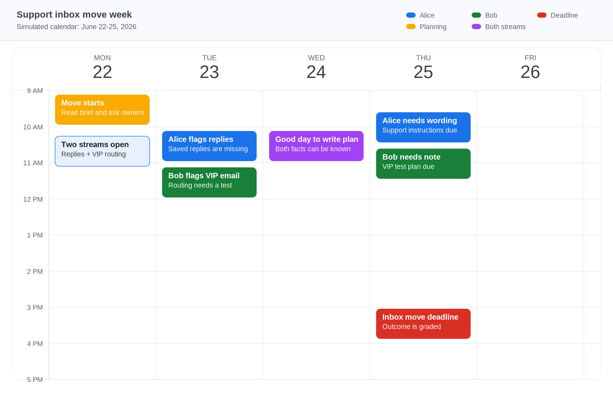

# Support Inbox Move

Poppy is moving customer support from an old shared inbox to a new help desk. The work happens during a Monday-Friday week: Thursday is the switch-readiness checkpoint, and Friday is the final outcome deadline.



## Characters

- Alice, Support Lead: knows the new help desk is missing the saved replies the team uses every day.
- Bob, Infrastructure Engineer: knows VIP customer emails may still route to the old inbox.

## Streams

### 1. Saved Replies

Problem: the old inbox has saved replies, but the new help desk did not import them.

Deadline: Thursday 12:00 PM for support-team readiness.

Owner to talk to: Alice.

Valid solutions:

- Ask Alice about saved replies, templates, support readiness, or old inbox backup.
- Move the top 12 saved replies before Thursday.
- Keep the old inbox read-only for one week as backup.
- Email Alice written wording the support team can follow.

Bad path:

- Say the new help desk is ready without moving saved replies.
- Close the old inbox immediately.

### 2. VIP Email Routing

Problem: VIP customer aliases bypass the default forwarding rule, so urgent emails may keep landing in the old inbox.

Deadline: Thursday 12:00 PM for routing readiness.

Owner to talk to: Bob.

Valid solutions:

- Ask Bob about VIP email routing, forwarding, aliases, or testing.
- Add VIP aliases to the forwarding allowlist.
- Send a test email to confirm VIP messages reach the new help desk.
- Email Bob the final routing plan.

Bad path:

- Assume normal forwarding covers VIP aliases.
- Skip the VIP routing test.

## Causal Path

The PM needs both streams:

1. Discover Alice's saved-reply risk.
2. Discover Bob's VIP-routing risk.
3. Write the Thursday Inbox Move Plan.
4. Email Alice and Bob their parts of the plan.
5. Reach Friday with both written updates complete.

## Guaranteed Events

- Tuesday 10:00 AM: Alice reminds the PM if saved replies have not been handled.
- Tuesday 11:00 AM: Bob reminds the PM if VIP routing has not been handled.
- Thursday 9:30 AM: Alice nudges again if she lacks written support-team wording.
- Thursday 10:00 AM: Bob nudges again if he lacks the routing note.
- Friday 3:00 PM: the inbox move outcome is evaluated.

## Starts Visible vs Hidden

Visible:

- The support inbox move brief.
- The empty Thursday Inbox Move Plan.
- The public blocker that there is no written move plan.
- Initial messages from Alice and Bob.

Hidden until discovered:

- Saved replies are missing from the new help desk.
- Moving the top 12 replies is enough if the old inbox stays read-only.
- VIP aliases bypass the default forwarding rule.
- A tested VIP forwarding allowlist fixes the routing gap.

Derived by agent action:

- The final inbox move plan.
- Alice's written support-team update.
- Bob's written VIP-routing update.

## Scoring

Saved replies (30 points):

- Discover Alice's saved-reply risk.
- Send Alice written support-team wording.

VIP routing (30 points):

- Discover Bob's VIP-routing risk.
- Send Bob written routing wording.

Written plan (25 points):

- Update the Thursday Inbox Move Plan with saved replies, VIP routing, old inbox backup, and both owners.

Final readiness (15 points):

- Both owners have written updates before the Thursday deadline.

## Best Path

```bash
pm-sim reset --scenario scenarios/support_inbox_move
pm-sim read-doc inbox_move_brief
pm-sim send-chat alice "For the support inbox move, are saved replies or old inbox backup a risk before Thursday?"
pm-sim advance-time until_next_event
pm-sim send-chat bob "For the new help desk, do VIP email aliases route correctly, and do we need a forwarding test?"
pm-sim advance-time until_next_event
pm-sim update-doc inbox_move_plan "Thursday inbox move plan: move the top 12 saved replies to the new help desk before Thursday. VIP forwarding is tested by adding VIP aliases to the forwarding rule and sending a test email. The old inbox stays read-only for one week as backup. Alice owns saved replies and Bob owns VIP routing; Alice and Bob are aligned."
pm-sim send-email alice "Support inbox move saved replies" "Support team can use this wording: the top 12 saved replies move to the new help desk before Thursday, and the old inbox stays read-only for one week as backup."
pm-sim send-email bob "Support inbox move VIP routing" "VIP aliases are on the forwarding allowlist, VIP forwarding is tested to the new help desk, and the old inbox stays open as backup for one week."
pm-sim advance-time to:2026-06-26T15:00:00
pm-sim evaluate --explain
```
